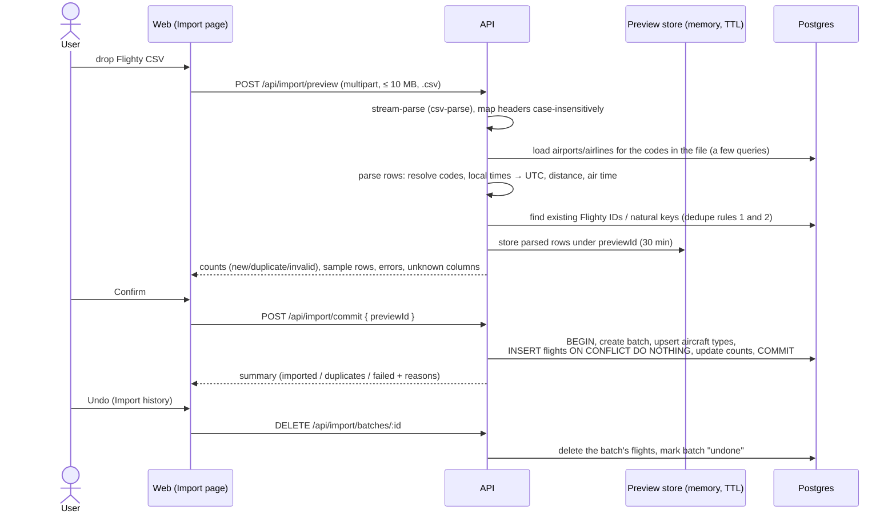

# Flight Log

A personal flight journal. Import your history from a **Flighty** CSV export (or add flights one at a
time), then explore it on a great-circle **map** and a **stats dashboard**.

Phase 1 is the full core app. Phase 2 (live flight-data lookups) is researched in
[`docs/flight-data-api-analysis.md`](docs/flight-data-api-analysis.md), and the provider seam already exists.

## Quick start

Requires Docker (Compose v2).

```bash
cp .env.example .env
docker compose up
```

Open **http://localhost:5173**. On first start the API runs migrations and downloads reference data
(about 11.8k airports from OurAirports and 6.1k airlines from OpenFlights, a few seconds). To try it
without your own data, import
[`apps/api/test/fixtures/flighty-sample.csv`](apps/api/test/fixtures/flighty-sample.csv) (synthetic
flights) on the **Import** page.

| Service | URL                              | Notes                                                                  |
| ------- | -------------------------------- | ---------------------------------------------------------------------- |
| web     | http://localhost:5173            | Vite dev server; proxies `/api` to the API                             |
| api     | http://localhost:3001/api/health | Express; `API_PORT` sets the host port                                 |
| db      | `localhost:5434`                 | Postgres 16; `DB_PORT` sets the host port. Also hosts `flightlog_test` |

Both apps hot-reload from the bind-mounted source. After changing dependencies, refresh the
container's `node_modules` volume: `docker compose down && docker volume rm flight-log_node_modules && docker compose up --build`.

### Running on the host (optional)

```bash
docker compose up -d db          # just Postgres
npm install
npm run db:migrate               # prisma migrate deploy (reads the root .env)
npm run seed:reference           # airports + airlines + default user
npm run dev                      # api on :3001, web on :5173
```

### Scripts

| Command                                    | What it does                                                                              |
| ------------------------------------------ | ----------------------------------------------------------------------------------------- |
| `npm test`                                 | All tests: shared unit, API unit + integration (needs the `db` container), web components |
| `npm run lint` / `npm run typecheck`       | ESLint (flat config) / `tsc --noEmit` in every workspace                                  |
| `npm run format` / `format:check`          | Prettier                                                                                  |
| `npm run seed:reference`                   | Download (or read from `data/`) and insert reference data                                 |
| `docker compose exec -w /app api npm test` | Run the suite inside Docker                                                               |

Set `FLIGHT_API_PROVIDER=stub` in `.env` to enable the demo **Look up flight** button (try `UA837` or `BA117`).

## Architecture

```
apps/api          Express + Prisma (run with tsx)
  prisma/         schema + migrations (the init migration adds a raw-SQL partial dedupe index)
  src/http/       error shape, async wrapper, resolveUser, access log
  src/dal/        user-scoped data access: flights, imports, stats, map; global reference data
  src/import/     CSV header mapping, pure row parser, preview store, preview/commit service
  src/services/   derived values (UTC conversion, distance, air time), manual create/update
  src/lookup/     FlightLookupProvider interface, Null + Stub providers, cached lookup service
  src/seed/       OurAirports / OpenFlights seeding
  test/           unit + supertest integration tests, synthetic Flighty fixture
apps/web          Vite + React 18 + React Router + TanStack Query + Tailwind + Recharts + MapLibre
packages/shared   Zod schemas, API types, haversine, great-circle points, normalization, Luxon time helpers
docs/             data-model.md (ERD), flight-data-api-analysis.md
docker/           dev image, api entrypoint (migrate → seed-if-empty → dev), test-DB init
```

- **One schema, both sides.** `packages/shared` is consumed as TypeScript source by the API (tsx),
  the web app (Vite) and the tests, so validation and types can't drift.
- **User scoping.** `resolveUser` sets `req.userId`; every DAL function takes `userId` first.
  Adding auth means replacing that one middleware.
- **Stats and map are SQL aggregates** (`src/dal/stats.ts`, `src/dal/map.ts`). The API
  precomputes great-circle paths with longitudes unwrapped across ±180°, so trans-Pacific arcs draw
  continuously in MapLibre.
- **Errors** always look like `{ "error": { "code", "message", "details?" } }`.

### Import data flow



### API

| Method           | Path                                                 |                                                                                                                                             |
| ---------------- | ---------------------------------------------------- | ------------------------------------------------------------------------------------------------------------------------------------------- |
| GET              | `/api/health`                                        | DB ping                                                                                                                                     |
| GET              | `/api/config`                                        | Map style URL, lookup status                                                                                                                |
| GET              | `/api/flights`                                       | `page, pageSize, sort (date, -date, distance, route, airline, flightNumber, aircraft, duration), year, yearFrom, yearTo, airline, cabin, q` |
| GET/PATCH/DELETE | `/api/flights/:id`                                   | Detail includes PNR and the raw CSV row                                                                                                     |
| POST             | `/api/flights`                                       | Times without an offset are local to the relevant airport                                                                                   |
| POST             | `/api/import/preview`                                | multipart field `file`                                                                                                                      |
| POST             | `/api/import/commit`                                 | `{ previewId }`                                                                                                                             |
| GET / DELETE     | `/api/import/batches[/:id]`                          | list / undo                                                                                                                                 |
| GET              | `/api/map`                                           | routes + airports (same filters)                                                                                                            |
| GET              | `/api/map/routes/:a/:b/flights`                      | flights on an undirected route                                                                                                              |
| GET              | `/api/stats`                                         | dashboard aggregates (same filters)                                                                                                         |
| GET              | `/api/filter-options`                                | years, airlines, cabins present in your data                                                                                                |
| GET              | `/api/airports/search?q=`, `/api/airlines/search?q=` | typeahead                                                                                                                                   |
| POST             | `/api/lookup`                                        | `{ flightNumber, date }`. Returns 501 `{ configured: false }` unless a provider is set                                                      |

`airline` filter values are an airline id, or `raw:<name>` for airlines not found in the reference data.

## Adding a flight-lookup provider

1. Create `apps/api/src/lookup/providers/<name>Provider.ts` implementing `FlightLookupProvider`
   (`name`, `isConfigured()`, `lookup({ flightNumber, date })`). Map the provider's payload into
   `FlightLookupResult`: UTC ISO times, IATA airport codes, and the untouched payload in `raw`.
2. Register it in `apps/api/src/lookup/registry.ts` (e.g. `case 'aerodatabox'`), reading its key
   from env (placeholders are already in `.env.example` and `docker-compose.yml`).
3. Set `FLIGHT_API_PROVIDER=<name>`. `/api/config` reports it as configured, and the form's
   **Look up flight** button enables and prefills from the first result.
4. Caching is automatic: `lookup/service.ts` reads and writes `flight_lookup_cache` (unique on
   provider + designator + date, TTL `LOOKUP_CACHE_TTL_HOURS`). No schema change is needed.

The analysis recommends **AeroDataBox** (free RapidAPI tier) as primary and **FlightAware AeroAPI**
(Personal tier) as fallback. See the doc for pricing checked on 2026-09-29.

## Assumptions

**Flighty CSV**

- **Times without an offset** are wall-clock times at the relevant airport. Gate departure and
  takeoff use the origin. Landing and gate arrival use the destination, except that _actual_ arrival
  times of a diverted flight use the diversion airport. Values with `Z` or an offset are honored as-is.
- **Dates** are tried as ISO first, then common variants. Ambiguous slash dates are read US-style
  (`M/D/YYYY`). Unparseable dates make the row invalid.
- **Airline** cells resolve by IATA (2 chars), then ICAO (3 letters), then exact name, then a
  previously seen Airline Flighty ID, then the carrier prefix of the `Flight` cell. When a code
  matches several airlines, active ones win. Unresolved airlines import with `airline_name_raw`
  (the preview shows a warning).
- **Flight numbers** are stored as the numeric designator only (`AA 0100` → `100`), and the UI shows
  it with the airline code (`AA 100`). The raw cell is kept in `source_raw`.
- **Airports** resolve by IATA then ICAO. When several share a code, larger types win and closed
  airfields lose. Only airports with an IATA or ICAO code are seeded (about 11.8k).
- `Canceled` accepts true/false/yes/no/y/n/1/0/blank. Anything else is a warning and treated as not canceled.
- Unknown columns are ignored and listed in the preview. Missing `Date`, `From` or `To` columns reject
  the whole file (422), since it's probably not a Flighty export.

**Derived values and stats**

- **Distance** is spherical haversine (mean radius 3,958.76 mi), stored to 0.1 mi. That is within about
  0.3% of the ellipsoidal figures sites like gcmap publish. Diverted flights are measured to the
  diversion airport.
- **Air time** is takeoff → landing (actual, else scheduled). Flights with only gate times have no air
  time. The dashboard says how many flights have times.
- **Diverted flights** count as arriving at the diversion airport on the map, for airport visits,
  and for routes.
- **Canceled flights** are excluded from the map, distance, time, frequency, records and punctuality.
  They stay in the flights list (struck through), and the dashboard shows a separate count.
- **Punctuality:** delay = actual − scheduled at the gate, falling back to runway times when a gate
  pair is missing. **On time = no more than 15 minutes late** (the US DOT definition). The headline
  on-time figure is for arrivals.
- **Busiest day** ties go to the most recent date. **Most-visited route** is direction-independent.
- "Around the Earth" uses 24,901 mi; "to the Moon" uses 238,855 mi.

**Dedupe and import**

- Rule 2 (no Flighty ID) only compares against other flights without a Flighty ID, so a manually
  added flight and a Flighty import of the same trip are not merged.
- Previews live in API memory for 30 minutes (`IMPORT_PREVIEW_TTL_MINUTES`). Restarting the API
  discards them, and the UI then asks you to re-upload. This assumes a single API process.
- **Undo** deletes every flight created by that batch, including ones you edited since. The batch
  record stays, marked "undone".

**Privacy**

- PNR and seat are shown only in the detail view and the edit form. They are excluded from list
  responses, search, stats and logs; the access log never includes bodies or query strings.
  `source_raw` keeps the entire CSV row, as specified (so it also contains the PNR), and is only
  returned by the detail endpoint.
- Only synthetic data is committed. `*.csv` is gitignored except under `apps/api/test/fixtures/`.

**Platform**

- Phase 1 has no auth. Every request acts as the seeded user `DEFAULT_USER_ID`.
- The map style URL comes from `MAP_STYLE_URL` and reaches the browser via `/api/config`, so one env
  var configures it. The default is OpenFreeMap "liberty", which needs no key.
- Default host ports are 5434 (db) and 3001 (api) so they don't collide with common local
  services. Change them in `.env`.
- Dependencies are pinned to proven major versions (React 18, React Router 7, Prisma 6, Express 4,
  Zod 3, Tailwind 3, Vite 5, Recharts 2, TypeScript 5.7) rather than the newest majors, for stability.
  **Known advisory:** `npm audit` reports `deepmerge-ts` < 8 (stack exhaustion on recursive objects),
  pulled in only by the Prisma CLI's config loader. It never sees request data, and npm's suggested
  fix is a Prisma downgrade, so it's left as-is until Prisma updates it.

## Fixture stats (hand-checked)

The fixture has 17 rows. The preview shows 13 new, 2 duplicates (a repeated Flighty ID and an HA11
row written differently) and 2 invalid (unknown airport `ZZX`, unparseable date). After commit,
12 flights were flown and 1 was canceled. These values were computed independently in Python
(`zoneinfo` + haversine) and are asserted in `apps/api/test/integration/stats.test.ts`:

| Stat                            | Value                                                                        |
| ------------------------------- | ---------------------------------------------------------------------------- |
| Flights / canceled              | 12 / 1                                                                       |
| Distance                        | 43,976.6 mi (1.766× around the Earth, 18.41% to the Moon)                    |
| Time in the air                 | 5,267 min across 11 flights (BOS–JFK has gate times only)                    |
| Airports / airlines / countries | 12 / 9 / 4                                                                   |
| Top airports                    | JFK 4, LAX 4, SFO 3, NRT 3                                                   |
| Longest / shortest              | LAX–SYD 7,494.4 mi / BOS–JFK 186.3 mi                                        |
| Most-flown route / busiest day  | SFO ↔ NRT (3) / 2023-06-01 (2 flights)                                       |
| Repeat tail                     | N24976 (3 flights)                                                           |
| Punctuality                     | avg departure +14.2 min, avg arrival +5.7 min, on time 72.7% dep / 90.9% arr |

## Troubleshooting

- **Postgres exits with "No space left on device"**: Docker Desktop's disk is full. Free space
  (`docker builder prune`) or raise the disk limit in Docker Desktop settings.
- **Port already allocated**: change `DB_PORT`, `API_PORT` or `WEB_PORT` in `.env`.
- **Reference download fails** (offline or firewalled): put `airports.csv` and `airlines.dat` in
  `data/` (see [`data/README.md`](data/README.md)) and run `npm run seed:reference`.

## Data attributions

- Airports: [OurAirports](https://ourairports.com/data/), public domain.
- Airlines: [OpenFlights](https://openflights.org/data.html) airline database, available under the
  [Open Database License (ODbL) 1.0](https://opendatacommons.org/licenses/odbl/1-0/).
- Timezones: [tz-lookup](https://github.com/darkskyapp/tz-lookup-oss) (derived from OpenStreetMap / timezone-boundary-builder data).
- Basemap: [OpenFreeMap](https://openfreemap.org) tiles © [OpenMapTiles](https://openmaptiles.org),
  data © [OpenStreetMap contributors](https://www.openstreetmap.org/copyright).

These attributions also appear in the app footer and the map's attribution control.
