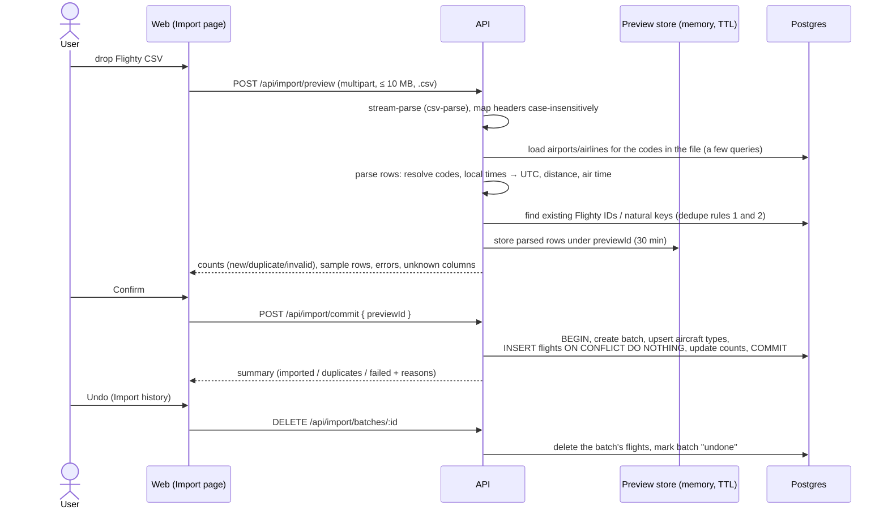

# Flight Log

A personal flight journal. Import your history from a **Flighty** CSV export (or add flights one at a
time), then explore it on a great-circle **map** and a **stats dashboard**.

Phase 1 is the full core app. Phase 2 (live flight-data lookups) is researched in
[`docs/flight-data-api-analysis.md`](docs/flight-data-api-analysis.md), and the provider seam already exists.

Licensed for **noncommercial use only**. See [License](#license).

**Where things are documented**

| Document                                                               | For           | Contents                                                                                               |
| ---------------------------------------------------------------------- | ------------- | ------------------------------------------------------------------------------------------------------ |
| This README                                                            | People        | Setup, architecture, components, design decisions, assumptions, how to extend, roadmap                 |
| [`docs/data-model.md`](docs/data-model.md)                             | Both          | ERD, dedupe rules, derived values, normalization                                                       |
| [`docs/flight-data-api-analysis.md`](docs/flight-data-api-analysis.md) | Both          | Phase 2 provider research and recommendation                                                           |
| [`docs/release-notes/`](docs/release-notes/)                           | Both          | Dated notes: what shipped, setup commands, pitfalls and workarounds                                    |
| [`docs/todo/`](docs/todo/)                                             | Both          | Open follow-ups and loose ends, by date                                                                |
| [`AGENTS.md`](AGENTS.md) (+ one per workspace)                         | Coding agents | Terse rules, invariants, gotchas and change checklists. `CLAUDE.md` files import them for Claude Code. |

The rationale lives here. The agent files state the resulting rules and link back, so update both
when a convention changes.

## Quick start

Requires Docker (Compose v2).

```bash
cp .env.example .env
docker compose up
```

Open **http://localhost:5173**. On first start the API runs migrations and downloads reference data
(about 11.8k airports from OurAirports and 6.1k airlines from OpenFlights, a few seconds). To try it
without your own data, import
[`apps/api/test/fixtures/flighty-sample.csv`](apps/api/test/fixtures/flighty-sample.csv) (synthetic
flights) on the **Import** page.

| Service | URL                              | Notes                                                                                                               |
| ------- | -------------------------------- | ------------------------------------------------------------------------------------------------------------------- |
| web     | http://localhost:5173            | Vite dev server; proxies `/api` to the API                                                                          |
| api     | http://localhost:3001/api/health | Express; `API_PORT` sets the host port                                                                              |
| docs    | http://localhost:3001/api/docs   | Swagger UI (spec at `/api/openapi.json`); also linked in the web footer. Set `ENABLE_API_DOCS=false` to turn it off |
| db      | `localhost:5434`                 | Postgres 16; `DB_PORT` sets the host port. Also hosts `flightlog_test`                                              |

Both apps hot-reload from the bind-mounted source. After changing dependencies, refresh the
container's `node_modules` volume: `docker compose down && docker volume rm flight-log_node_modules && docker compose up --build`.

### Running on the host (optional)

```bash
docker compose up -d db          # just Postgres
npm install
npm run db:migrate               # prisma migrate deploy (reads the root .env)
npm run seed:reference           # airports + airlines + default user
npm run seed:aircraft-families   # aircraft families + assign them to aircraft types (idempotent)
npm run dev                      # api on :3001, web on :5173
```

### Scripts

| Command                                             | What it does                                                                                        |
| --------------------------------------------------- | --------------------------------------------------------------------------------------------------- |
| `npm test`                                          | All tests: shared unit, API unit + integration (needs the `db` container), web components           |
| `npm run lint` / `npm run typecheck`                | ESLint (flat config) / `tsc --noEmit` in every workspace                                            |
| `npm run format` / `format:check`                   | Prettier                                                                                            |
| `npm run release` / `release:dry` / `release:check` | Bump version from conventional commits, commit + tag (see [Releases](#releases)) / preview / verify |
| `npm run seed:reference`                            | Download (or read from `data/`) and insert reference data                                           |
| `npm run seed:aircraft-families`                    | Create aircraft family rows and assign a family to each aircraft type that has none                 |
| `npm run user:create -w @flight-log/api -- …`       | Create a login, or `--adopt-default` (see [Authentication](#authentication))                        |
| `docker compose exec -w /app api npm test`          | Run the suite inside Docker                                                                         |

Set `FLIGHT_API_PROVIDER=stub` in `.env` to enable the demo **Look up flight** button (try `UA837` or `BA117`).

## Architecture

```
apps/api          Express + Prisma (run with tsx)
  prisma/         schema + migrations (the init migration adds a raw-SQL partial dedupe index)
  src/http/       error shape, async wrapper, resolveUser, CSRF guard, access log
  src/auth/       scrypt passwords, sessions, cookies, login throttle, user CLI
  src/dal/        user-scoped data access: flights, imports, stats, map; global reference data
  src/import/     CSV header mapping, pure row parser, preview store, preview/commit service
  src/services/   derived values (UTC conversion, distance, air time), manual create/update
  src/lookup/     FlightLookupProvider interface, Null + Stub providers, cached lookup service
  src/seed/       OurAirports / OpenFlights seeding
  test/           unit + supertest integration tests, synthetic Flighty fixture
apps/web          Vite + React 18 + React Router + TanStack Query + Tailwind + Recharts + MapLibre
packages/shared   Zod schemas, API types, haversine, great-circle points, normalization, Luxon time helpers
docs/             data-model.md (ERD), flight-data-api-analysis.md, release-notes/, todo/
docker/           dev image, api entrypoint (migrate → seed-if-empty → dev), test-DB init
deploy/           production deploy (Lightsail + k3s + CloudNativePG): Dockerfiles, k8s manifests, scripts
```

API request path: `requestLog → csrfGuard → express.json → resolveUser → router (Zod-validated) → service / import →
dal → Prisma`, with `errorHandler` turning every failure into `{ "error": { "code", "message", "details?" } }`.
Why it's shaped this way is in [Design decisions](#design-decisions).

### Components

**API (`apps/api/src`)**

| Module                         | Responsibility                                                                                                                                                      |
| ------------------------------ | ------------------------------------------------------------------------------------------------------------------------------------------------------------------- |
| `app.ts`, `index.ts`, `env.ts` | App factory (tests call `createApp()`), server start, typed env with root `.env` loading                                                                            |
| `http/`                        | `AppError` + error handler, `route()` async wrapper, `resolveUser` (the only place `req.userId` is set), `csrfGuard`, access log (no bodies)                        |
| `auth/`                        | `password` (scrypt), `sessions` (create / lookup-and-refresh / delete), `cookies`, `throttle`, `users` (create, adopt, set password), `cli`                         |
| `routes/`                      | Thin routers: `auth`, `flights`, `import`, `insights` (map, stats, filter options), `reference` (search), `lookup`                                                  |
| `services/derive.ts`           | Local time → UTC by airport zone, great-circle distance, air time. Shared by import and the form.                                                                   |
| `services/flights.ts`          | Manual create and PATCH (merge, then recompute every derived value)                                                                                                 |
| `import/`                      | `columns.ts` header mapping → `parseRow.ts` pure row parser + `naturalKey` → `service.ts` preview/commit → `previewStore.ts`                                        |
| `dal/`                         | All SQL. User-scoped `flights`, `imports`, `stats`, `map`. Global `reference` (search, code resolution, aircraft types). `filters.ts` Prisma + SQL filter builders. |
| `lookup/`                      | `FlightLookupProvider` interface, `NullProvider` / `StubProvider`, registry, cached lookup service                                                                  |
| `seed/`                        | OurAirports + OpenFlights parsing and insertion, default user                                                                                                       |

**Web (`apps/web/src`)**

| Piece                                                                  | Responsibility                                                                                                                                                                                                                  |
| ---------------------------------------------------------------------- | ------------------------------------------------------------------------------------------------------------------------------------------------------------------------------------------------------------------------------- |
| `pages/MapPage` + `components/FlightMap`                               | MapLibre map: frequency-weighted arcs, sized airport markers, popups, route list and route flights panel                                                                                                                        |
| `pages/FlightsPage` + `components/FlightDetail`, `Drawer`              | Sortable, filterable, paginated table; detail drawer (`?flight=<id>`) with local times; delete                                                                                                                                  |
| `pages/FlightFormPage` + `components/Combobox`                         | Add/edit form with airport/airline typeahead, live distance, local-time inputs, **Look up flight**                                                                                                                              |
| `pages/ImportPage`                                                     | Drag-and-drop upload, preview (counts, sample, errors), commit summary, import history + undo                                                                                                                                   |
| `pages/StatsPage` + `components/charts`, `SortableTable`               | Headline cards, records, punctuality, Recharts charts with table views, mi/km toggle (defaults to your distance preference)                                                                                                     |
| `components/FilterBar`, `lib/useFilters`                               | Year range, airline and cabin filters stored in the URL, shared by map, list and stats                                                                                                                                          |
| `components/Layout`, `States`                                          | Nav, attribution footer; spinner, error (with retry) and empty states                                                                                                                                                           |
| `pages/LoginPage`, `ProfilePage`, `components/RequireAuth`, `UserMenu` | Sign in (returns to the page you asked for), route guard, user menu, profile (name, preferences, email, password, active sessions, data export, delete-all; the email, password and sessions parts are hidden when auth is off) |
| `api/client`, `api/hooks`                                              | `fetch` wrapper with typed errors; every TanStack Query hook plus cache invalidation                                                                                                                                            |
| `lib/format`, `lib/useChartTheme`                                      | Display formatting (dates, distances, local times, country names); chart colors from CSS tokens                                                                                                                                 |

**Shared (`packages/shared/src`)**: `schemas.ts` (Zod inputs), `types.ts` (API responses), `distance.ts`,
`geo.ts` (great circle with unwrapped longitudes), `normalize.ts`, `time.ts` (Luxon parsing/formatting), `constants.ts`.

### Import data flow



### API

| Method           | Path                                                 |                                                                                                                                                  |
| ---------------- | ---------------------------------------------------- | ------------------------------------------------------------------------------------------------------------------------------------------------ |
| GET              | `/api/health`                                        | DB ping                                                                                                                                          |
| POST             | `/api/auth/login`, `/logout`                         | `{ email, password }` sets the session cookie; logout clears it (204, works without a session)                                                   |
| GET / PATCH      | `/api/auth/me`                                       | current user + `authRequired`; PATCH `{ displayName }` renames the current user (trimmed, 1 to 80 characters)                                    |
| POST             | `/api/auth/password`                                 | `{ currentPassword, newPassword }` signs out your other sessions                                                                                 |
| PUT              | `/api/auth/email`                                    | `{ newEmail, currentPassword }` changes the email immediately (409 `email_unavailable` if taken) and signs out your other sessions               |
| GET              | `/api/auth/sessions`                                 | your unexpired sessions: `[{ id, createdAt, lastSeenAt, userAgent, current }]` (never tokens)                                                    |
| DELETE / POST    | `/api/auth/sessions/:id`, `/sessions/revoke-others`  | sign out one session (404 unless it is yours) / every session except the current one                                                             |
| GET / PATCH      | `/api/auth/preferences`                              | `{ distanceUnit: mi\|km, timeFormat: 12h\|24h, homeAirportId }` plus the resolved `homeAirport`; defaults `mi`, `12h`, none. Works with auth off |
| GET              | `/api/config`                                        | Map style URL, lookup status, API docs URL                                                                                                       |
| GET              | `/api/docs`, `/api/openapi.json`                     | Swagger UI and the raw OpenAPI spec (`ENABLE_API_DOCS`, on by default)                                                                           |
| GET              | `/api/flights`                                       | `page, pageSize, sort (date, -date, distance, route, airline, flightNumber, aircraft, duration), year, yearFrom, yearTo, airline, cabin, q`      |
| GET/PATCH/DELETE | `/api/flights/:id`                                   | Detail includes PNR and the raw CSV row                                                                                                          |
| POST             | `/api/flights`                                       | Times without an offset are local to the relevant airport                                                                                        |
| GET              | `/api/flights/export?format=csv\|json`               | download all your flights (includes PNR and seat; `Content-Disposition`, `no-store`). CSV uses the Flighty columns, so it imports again          |
| DELETE           | `/api/flights?confirm=delete-all-flights`            | delete ALL your flights and import batches; returns `{ deleted, deletedImportBatches }`. 400 without the confirmation                            |
| POST             | `/api/import/preview`                                | multipart field `file`                                                                                                                           |
| POST             | `/api/import/commit`                                 | `{ previewId }`                                                                                                                                  |
| GET / DELETE     | `/api/import/batches[/:id]`                          | list / undo                                                                                                                                      |
| GET              | `/api/map`                                           | routes + airports (same filters)                                                                                                                 |
| GET              | `/api/map/routes/:a/:b/flights`                      | flights on an undirected route                                                                                                                   |
| GET              | `/api/stats`                                         | dashboard aggregates (same filters)                                                                                                              |
| GET              | `/api/filter-options`                                | years, airlines, cabins present in your data                                                                                                     |
| GET              | `/api/airports/search?q=`, `/api/airlines/search?q=` | typeahead                                                                                                                                        |
| POST             | `/api/lookup`                                        | `{ flightNumber, date }`. Returns 501 `{ configured: false }` unless a provider is set                                                           |

With `AUTH_REQUIRED=true` every route except `GET /api/health` and `POST /api/auth/login` (and logout) needs the session cookie (401 `unauthenticated`); see [Authentication](#authentication).

`airline` filter values are an airline id, or `raw:<name>` for airlines not found in the reference data.

## Design decisions

| Decision                                                                                         | Why                                                                                                                                                                              | Trade-off                                                                 |
| ------------------------------------------------------------------------------------------------ | -------------------------------------------------------------------------------------------------------------------------------------------------------------------------------- | ------------------------------------------------------------------------- |
| **npm-workspaces monorepo with `packages/shared` consumed as TS source**                         | One set of Zod schemas and response types for API, web and tests, with no build step or publish cycle                                                                            | Every consumer must compile TS (tsx, Vite and Vitest all do)              |
| **API runs on `tsx` in dev and in Docker**                                                       | No separate build output to keep in sync during Phase 1                                                                                                                          | Not a production artifact; see Roadmap                                    |
| **Prisma for schema and CRUD; tagged raw SQL for aggregates**                                    | Prisma gives migrations and typed CRUD. Stats and map need `GROUP BY`, CTEs and `FILTER` clauses that are clearer in SQL.                                                        | Filters exist twice (`filtersWhere` / `filtersSql`) and must stay in sync |
| **Dedupe in the database** (unique + partial expression index) **and in the app** (`naturalKey`) | The DB guarantees idempotency even under races (`ON CONFLICT DO NOTHING`); the app mirror lets the preview report duplicates before writing                                      | Prisma can't model the partial index, so new migrations must be reviewed  |
| **Preview stored in memory with a TTL**                                                          | Commit doesn't need a re-upload, and it's simple for a single-user, single-process app                                                                                           | Lost on restart; not multi-instance (Roadmap)                             |
| **Pure `parseRow` with a preloaded reference index**                                             | A few queries per file instead of per row; the parser is unit-testable without a DB                                                                                              | Very large files hold the index and rows in memory (capped at 20k rows)   |
| **Store UTC; interpret naive times in the airport's IANA zone** (`tz-lookup` at seed time)       | Correct across DST and the date line; one rule shared by CSV import and the form                                                                                                 | Requires every airport to have a zone (falls back to UTC)                 |
| **Derived values computed server-side and stored**                                               | Distance and air time can't drift from their inputs, and aggregates stay cheap                                                                                                   | Changing the formula needs a backfill                                     |
| **"Effective arrival" = diversion airport**                                                      | Matches where the traveler actually went (distance, map, visits)                                                                                                                 | Scheduled-arrival stats use the planned destination                       |
| **Own great-circle function (not `@turf/great-circle`) that unwraps longitudes**                 | Turf splits antimeridian arcs into MultiLineStrings; unwrapped lines render as one continuous arc in MapLibre and are easy to test                                               | A little more code to own                                                 |
| **Great-circle paths computed by the API**                                                       | The browser gets ready-to-draw GeoJSON, and route collapsing happens in SQL                                                                                                      | Slightly larger `/api/map` payload                                        |
| **`maplibre-gl` used directly (no `react-map-gl`)**                                              | Fewer version couplings; the map is one imperative component                                                                                                                     | Manual lifecycle handling (resize, remount guards)                        |
| **Map style URL served by `/api/config`**                                                        | One env var (`MAP_STYLE_URL`) for all environments, and no Vite rebuild to change it                                                                                             | One extra request at startup                                              |
| **Filters in the URL**                                                                           | Shareable, reload-safe views. Map, list and stats read the same parameters through `useFilters`                                                                                  | Filters don't carry over when you switch pages from the nav (Roadmap)     |
| **Single-hue charts, horizontal bars, no pies, table views, separate light/dark tokens**         | Color-blind safe and readable on mobile, with an accessible fallback for every chart                                                                                             | Less decorative                                                           |
| **`resolveUser` middleware + user-scoped DAL**                                                   | Auth only decides who `req.userId` is: the default user, or the user of a valid session cookie. No query changed when login was added                                            | Every DAL function carries a `userId` parameter                           |
| **Opt-in, in-app auth: scrypt + DB sessions, no libraries**                                      | Node's built-in `crypto.scrypt` needs no dependency (license rule), and sessions in Postgres can be revoked (logout, password change)                                            | One lookup per request; login throttle is per process, not shared         |
| **Explicit preference columns on `users`, not a JSON blob**                                      | `home_airport_id` needs a real foreign key (`ON DELETE SET NULL`), and CHECK constraints keep the unit and clock values to a known set with no app-side migration of stored JSON | A new preference is a small migration                                     |
| **Pinned, proven major versions**                                                                | Predictable builds while the feature set settles                                                                                                                                 | Upgrades are planned work (Roadmap)                                       |

## Authentication

Off by default so local development stays login-free. Set `AUTH_REQUIRED=true` (API env; passed
through by `docker-compose.yml`) to require a login. Production sets it in the API ConfigMap, and the
Traefik basic auth that used to guard the site is gone.

- **Login.** `POST /api/auth/login` with an email and password (the email is lower-cased and trimmed).
  On success the API creates a row in `sessions` and sets the `flightlog_session` cookie: a random
  32-byte token, HttpOnly, SameSite=Lax, `Secure` in production. Only the token's SHA-256 is stored.
  Unknown email, wrong password and an account without a password all return the same 401, and each
  runs a full scrypt check so response time does not reveal which accounts exist.
- **Passwords.** `crypto.scrypt` (N=2^15, r=8, p=1, 16-byte salt, 64-byte key) stored as
  `scrypt$N$r$p$salt$hash`, so the cost can be raised later. 12 to 128 characters, no composition
  rules, must not equal the email.
- **Sessions.** 30-day sliding expiry (`SESSION_TTL_DAYS`), extended at most once an hour while you use
  the app. Logout deletes the session. Changing your password or email signs out your other sessions.
  Each session records the browser's `User-Agent` at login (truncated to 200 characters; no IP address is
  stored) so the Profile page can label devices.
- **Abuse limits.** Failed-login throttling per IP and per email (in memory, per API process; 429 with
  `Retry-After`). With auth on, non-GET requests must be same-origin (`Origin`, else `Sec-Fetch-Site`),
  otherwise 403 `csrf_rejected`. Behind Traefik the API trusts one proxy hop (`TRUST_PROXY_HOPS`).
- **`resolveUser`** stays the only place `req.userId` is set. With auth on it never falls back to the
  default user.
- **Web.** `/login` returns you to the page you asked for (only same-origin relative paths are honored).
  Any 401 sends you back to `/login`. A user menu offers Profile and Sign out. With auth off the
  API reports `authRequired: false`, there is no login UI, and the header shows just a link to Profile.
- **Profile.** `/profile` edits the display name (`PATCH /api/auth/me`, trimmed, 1 to 80 characters,
  only the current user) and holds the change-password form (`POST /api/auth/password`, unchanged).
  With auth off only the name section is shown, with a note that credentials are managed elsewhere.
  `/change-password` and the old `/account/password` redirect to `/profile`.
  With auth on it also has an **Email** section (`PUT /api/auth/email`: re-checks your password with the
  same scrypt path and the same throttle as the password endpoint, normalizes the address like login,
  keeps this session, signs out the rest) and an **Active sessions** section (device labels parsed from
  the User-Agent, per-device sign out, and a confirmed "Sign out other devices"). Email and the session
  routes answer 400 `auth_disabled` when `AUTH_REQUIRED` is off.

**Adding a user** (there is no signup page). From `apps/api`, against the database in `.env`:

```bash
npm run user:create -w @flight-log/api -- --email you@example.com --name "Your Name"
```

Give the seeded default user (which already owns your imported flights) a login instead of creating a
new row. It fails if that user already has a password, unless you pass `--force`:

```bash
npm run user:create -w @flight-log/api -- --adopt-default --email you@example.com --name "Your Name"
```

Reset a password (also signs that user out everywhere):

```bash
npm run user:set-password -w @flight-log/api -- --email you@example.com
```

The password is prompted for twice without echo on a terminal; otherwise one line is read from stdin
(`printf '%s\n' "$PW" | npm run user:create …`). It is never printed. In production see
[`deploy/README.md`](deploy/README.md#enabling-login-on-an-existing-deployment-replaces-basic-auth).

## Releases

One version for the whole repo (api, web and shared ship together). The git tag `vX.Y.Z` is the source of
truth; `scripts/release.mjs` keeps every `package.json`, `package-lock.json` and `CHANGELOG.md` in step with it.

| Commit (Conventional Commits)                       | Bump              |
| --------------------------------------------------- | ----------------- |
| `feat!:`, `fix!:` or a `BREAKING CHANGE:` footer    | major             |
| `feat:`                                             | minor             |
| `fix:`, `perf:`                                     | patch             |
| `docs`, `chore`, `test`, `refactor`, `ci`, `deploy` | none (no release) |

The script looks at **all commits since the last `v*` tag** and applies the highest bump, so a `docs:` commit
on top of a `feat:` still releases a minor. A breaking change on `0.x` goes to `1.0.0`.

- **Locally:** `npm run release:dry` previews, `npm run release` commits `chore(release): vX.Y.Z` and tags it,
  then `git push --follow-tags`. Running it again with nothing new is a no-op.
- **CI:** `.github/workflows/images.yml` runs the same script on every push to `main`, pushes the release
  commit and tag (`[skip ci]`), creates the GitHub Release from the changelog section, and builds the images
  tagged `latest`, `sha-<commit>` and (on a release) `X.Y.Z`. `release-check.yml` shows the next version on PRs.
- **Where the version appears:** `GET /api/health` and the OpenAPI `info.version` (from `apps/api/package.json`),
  and the web footer (`__APP_VERSION__`, injected by Vite from `apps/web/package.json`).
- **Baseline:** the first release needs an existing tag (`v0.1.0`). Push it once with `git push origin v0.1.0`.

## Extending the app

**Conventions to keep** (enforced by review and tests; agents get the same list in `AGENTS.md`):
user-owned data only through `src/dal/*` scoped by `userId`; PNR and seat only in detail/edit; times
stored UTC with the airport-zone rule; derived values computed server-side; API shapes defined in
`packages/shared`; every data view has loading, error and empty states. Before you finish, run
`npm run lint && npm run typecheck && npm test`.

### Add an API endpoint

1. Put request schemas in `packages/shared/src/schemas.ts` and response types in `types.ts`.
2. Add a handler to the right router in `apps/api/src/routes/`. Parse input with Zod and wrap it in
   `route()`. Put database access in a `src/dal/` function that takes `userId` first.
3. Mount new routers in `src/app.ts`, add a hook in `apps/web/src/api/hooks.ts`, and write a
   supertest integration test in `apps/api/test/integration/`.

### Change the database schema

1. Edit `apps/api/prisma/schema.prisma`.
2. Create the migration **without applying it**:
   `npm run prisma -w @flight-log/api -- migrate dev --create-only --name <change>`.
3. **Review the SQL.** Prisma will try to `DROP INDEX` the hand-written indexes
   (`flights_dedupe_natural_key`, `airports_name_lower_idx`, …). Delete those lines.
4. Apply with `npm run db:migrate`, then update the DAL mappers, shared types and `docs/data-model.md`.

### Add a statistic or chart

Add a query to `apps/api/src/dal/stats.ts`, reusing `baseCte` and the `flown` CTE so canceled flights
stay excluded. Extend the `Stats` type, render it in `StatsPage.tsx` inside a `ChartCard` (which
gives you the empty state and table toggle), and add an assertion to `stats.test.ts`. If the fixture
changes, recompute the expected values independently.

### Add a filter

Extend `FlightFiltersSchema`, then implement it in **both** `filtersWhere` and `filtersSql`
(`apps/api/src/dal/filters.ts`), add the key to `useFilters`, and add a control to `FilterBar`.

### Add a page

Create `apps/web/src/pages/<Name>Page.tsx`, add a route in `App.tsx` (use `React.lazy` if it pulls
in a heavy library), and add a nav entry in `components/Layout.tsx`. Handle loading, error and empty
states, and check it at phone width in light and dark mode.

### Add a flight-lookup provider

1. Create `apps/api/src/lookup/providers/<name>Provider.ts` implementing `FlightLookupProvider`
   (`name`, `isConfigured()`, `lookup({ flightNumber, date })`). Map the provider's payload into
   `FlightLookupResult`: UTC ISO times, IATA airport codes, and the untouched payload in `raw`.
2. Register it in `apps/api/src/lookup/registry.ts` (e.g. `case 'aerodatabox'`), reading its key
   from env (placeholders are already in `.env.example` and `docker-compose.yml`).
3. Set `FLIGHT_API_PROVIDER=<name>`. `/api/config` reports it as configured, and the form's
   **Look up flight** button enables and prefills from the first result.
4. Caching is automatic: `lookup/service.ts` reads and writes `flight_lookup_cache` (unique on
   provider + designator + date, TTL `LOOKUP_CACHE_TTL_HOURS`). No schema change is needed.

The analysis recommends **AeroDataBox** (free RapidAPI tier) as primary and **FlightAware AeroAPI**
(Personal tier) as fallback. See the doc for pricing checked on 2026-09-29.

## Assumptions

**Preferences, export and delete-all**

- **Preferences are display-only.** Flights stay stored in miles and UTC, derived values (distance, air
  time) are computed server-side as before, and `/api/stats` still returns miles. The web app converts
  for display. They work with `AUTH_REQUIRED` off (they belong to the default user).
- **The default clock is 12-hour**, so times in the flight detail look different from before this
  feature (they were always 24-hour). Choose 24-hour on the Profile page to get the old look. The
  date/time inputs in the flight form follow the browser's own locale, not this setting.
- **Home airport** only pre-fills the departure airport of a _new_ flight (once; you can clear it).
- **Export is the user's own data, detail-level.** It includes PNR and seat, is sent with
  `Cache-Control: no-store` and `Content-Disposition: attachment`, and is never logged. It is loaded in
  memory in one query, which is fine at personal scale (the importer caps files at 20k rows).
- **CSV round trip.** Columns and headers are the Flighty ones, times are written as UTC instants
  (`…Z`, which the importer honors), airports and airlines as IATA (else ICAO) codes. Re-importing an
  export recognizes every row as a duplicate (Flighty ID, or the natural key for manual flights), and
  importing it into an empty log rebuilds the same flights. Not preserved: derived values (recomputed),
  the original raw CSV row (`source_raw`; only the JSON export has it), and the text that was in the
  Airline cell when the airline resolved. Cells are written as-is, so a note starting with `=` is a
  formula if you open the CSV in a spreadsheet; guarding against that would change the data.
- **Delete-all is permanent.** It removes the user's flights and import batches in one transaction
  (never another user's, never reference data). There is no undo or soft delete, so export first. Any
  unsaved import preview is unaffected and could still be committed.

**Flighty CSV**

- **Times without an offset** are wall-clock timefiorde relevant airport. Gate departure and
  takeoff use the origin. Landing and gate arrival use the destination, except that _actual_ arrival
  times of a diverted flight use the diversion airport. Values with `Z` or an offset are honored as-is.
- **Dates** are tried as ISO first, then common variants. Ambiguous slash dates are read US-style
  (`M/D/YYYY`). Unparseable dates make the row invalid.
- **Airline** cells resolve by IATA (2 chars), then ICAO (3 letters), then exact name, then a
  previously seen Airline Flighty ID, then the carrier prefix of the `Flight` cell. When a code
  matches several airlines, active ones win. Unresolved airlines import with `airline_name_raw`
  (the preview shows a warning).
- **Flight numbers** are stored as the numeric designator only (`AA 0100` → `100`), and the UI shows
  it with the airline code (`AA 100`). The raw cell is kept in `source_raw`.
- **Airports** resolve by IATA then ICAO. When several share a code, larger types win and closed
  airfields lose. Only airports with an IATA or ICAO code are seeded (about 11.8k).
- `Canceled` accepts true/false/yes/no/y/n/1/0/blank. Anything else is a warning and treated as not canceled.
- Unknown columns are ignored and listed in the preview. Missing `Date`, `From` or `To` columns reject
  the whole file (422), since it's probably not a Flighty export.

**Derived values and stats**

- **Distance** is spherical haversine (mean radius 3,958.76 mi), stored to 0.1 mi. That is within about
  0.3% of the ellipsoidal figures sites like gcmap publish. Diverted flights are measured to the
  diversion airport.
- **Air time** is takeoff → landing (actual, else scheduled). Flights with only gate times have no air
  time. The dashboard says how many flights have times.
- **Time between gates** is gate departure → gate arrival (actual pair, else scheduled pair; never mixed),
  stored as `gate_time_minutes` and independent of air time. Same rejection rules (≤ 0 or > 30 h → none).
- **Diverted flights** count as arriving at the diversion airport on the map, for airport visits,
  and for routes.
- **Canceled flights** are excluded from the map, distance, time, frequency, records and punctuality.
  They stay in the flights list (struck through), and the dashboard shows a separate count.
- **Punctuality:** delay = actual − scheduled at the gate, falling back to runway times when a gate
  pair is missing. **On time = no more than 15 minutes late** (the US DOT definition). The headline
  on-time figure is for arrivals.
- **Busiest day** ties go to the most recent date. **Most-visited route** is direction-independent.
- "Around the Earth" uses 24,901 mi; "to the Moon" uses 238,855 mi.

**Dedupe and import**

- Rule 2 (no Flighty ID) only compares against other flights without a Flighty ID, so a manually
  added flight and a Flighty import of the same trip are not merged.
- Previews live in API memory for 30 minutes (`IMPORT_PREVIEW_TTL_MINUTES`). Restarting the API
  discards them, and the UI then asks you to re-upload. This assumes a single API process.
- **Undo** deletes every flight created by that batch, including ones you edited since. The batch
  record stays, marked "undone".

**Privacy**

- PNR and seat are shown only in the detail view and the edit form. They are excluded from list
  responses, search, stats and logs; the access log never includes bodies or query strings.
  `source_raw` keeps the entire CSV row, as specified (so it also contains the PNR), and is only
  returned by the detail endpoint.
- Only synthetic data is committed. `*.csv` is gitignored except under `apps/api/test/fixtures/`.

**Platform**

- Auth is opt-in. With `AUTH_REQUIRED` off (the default; local dev) every request acts as the seeded user `DEFAULT_USER_ID` and the web app shows no login UI. With it on, requests act as the user of the session cookie. There is no signup, email verification, password reset, MFA or roles; accounts are created with the CLI. **Changing your email is immediate**: with no email delivery there is no confirmation link, so the current password is the only check (a typo locks you out of the old address until you change it back or an admin runs `user:set-password`). Session "device" labels come from the client-supplied `User-Agent`, so treat them as a hint, not proof (see [Authentication](#authentication)).
- The map style URL comes from `MAP_STYLE_URL` and reaches the browser via `/api/config`, so one env
  var configures it. The default is OpenFreeMap "liberty", which needs no key.
- Default host ports are 5434 (db) and 3001 (api) so they don't collide with common local
  services. Change them in `.env`.
- Dependencies are pinned to proven major versions (React 18, React Router 7, Prisma 6, Express 4,
  Zod 3, Tailwind 3, Vite 5, Recharts 2, TypeScript 5.7) rather than the newest majors, for stability.
  **Known advisory:** `npm audit` reports `deepmerge-ts` < 8 (stack exhaustion on recursive objects),
  pulled in only by the Prisma CLI's config loader. It never sees request data, and npm's suggested
  fix is a Prisma downgrade, so it's left as-is until Prisma updates it.

## Fixture stats (hand-checked)

The fixture has 17 rows. The preview shows 13 new, 2 duplicates (a repeated Flighty ID and an HA11
row written differently) and 2 invalid (unknown airport `ZZX`, unparseable date). After commit,
12 flights were flown and 1 was canceled. These values were computed independently in Python
(`zoneinfo` + haversine) and are asserted in `apps/api/test/integration/stats.test.ts`:

| Stat                            | Value                                                                        |
| ------------------------------- | ---------------------------------------------------------------------------- |
| Flights / canceled              | 12 / 1                                                                       |
| Distance                        | 43,976.6 mi (1.766× around the Earth, 18.41% to the Moon)                    |
| Time in the air                 | 5,267 min across 11 flights (BOS–JFK has gate times only)                    |
| Time between gates              | 5,762 min across 12 flights (actual gate pair, else scheduled)               |
| Airports / airlines / countries | 12 / 9 / 4                                                                   |
| Top airports                    | JFK 4, LAX 4, SFO 3, NRT 3                                                   |
| Longest / shortest              | LAX–SYD 7,494.4 mi / BOS–JFK 186.3 mi                                        |
| Most-flown route / busiest day  | SFO ↔ NRT (3) / 2023-06-01 (2 flights)                                       |
| Repeat tail                     | N24976 (3 flights)                                                           |
| Punctuality                     | avg departure +14.2 min, avg arrival +5.7 min, on time 72.7% dep / 90.9% arr |

## Roadmap

**Phase 2: live flight lookups** (seam in place, see [the analysis](docs/flight-data-api-analysis.md))

- [ ] `AeroDataBoxProvider` (primary) and `FlightAwareProvider` (fallback), plus a provider chain
      that tries the next one on no-match or quota errors.
- [ ] Show provider attribution next to looked-up values (required by AeroDataBox's free plan).
- [ ] Optional enrichment: tail number → aircraft type via adsbdb, cached per registration.
- [ ] Fill the Phase 2 columns (`cruise_altitude_ft`, `max_altitude_ft`, `ground_speed_kts`,
      `lookup_source`, `lookup_fetched_at`) when a lookup result is saved.

**Platform**

- [x] Authentication: email + password with database sessions (done; see [Authentication](#authentication)).
- [x] Per-user preferences (distance unit, clock, home airport), data export (CSV/JSON) and delete-all
      (done; see [Assumptions](#assumptions)).
- [ ] Undo for delete-all (soft delete or an automatic export), and streaming export for very large logs.
- [ ] Later auth options: OIDC (would add an `oidc_subject` column), password reset, MFA/passkeys.
- [ ] Production build: compile the API (or bundle with esbuild), serve `apps/web/dist` statically,
      and add a production Dockerfile and compose profile.
- [ ] Move import previews to a DB table (e.g. `import_previews` with `expires_at`) for multiple
      API instances and restarts.
- [ ] Reference data refresh: make seeding upsert (today it only inserts new rows).
- [ ] Planned dependency upgrades: React 19, Prisma 7, Zod 4, Tailwind 4, Recharts 3, Express 5,
      Vite 6+. Clears the `deepmerge-ts` advisory once Prisma ships a fix.
- [ ] Split the map bundle further (MapLibre is about 1 MB minified).
- [ ] Carry active filters across pages when navigating (nav links currently drop the query string).

**Product ideas** (Phase 1 out-of-scope list): sharing / public profiles, GeoJSON export, native
apps, email/PDF ticket parsing, numeric sorting of flight numbers, re-normalizing existing rows when
normalization rules change.

## Troubleshooting

- **Postgres exits with "No space left on device"**: Docker Desktop's disk is full. Free space
  (`docker builder prune`) or raise the disk limit in Docker Desktop settings.
- **Port already allocated**: change `DB_PORT`, `API_PORT` or `WEB_PORT` in `.env`.
- **Reference download fails** (offline or firewalled): put `airports.csv` and `airlines.dat` in
  `data/` (see [`data/README.md`](data/README.md)) and run `npm run seed:reference`.

## Data attributions

- Airports: [OurAirports](https://ourairports.com/data/), public domain.
- Airlines: [OpenFlights](https://openflights.org/data.html) airline database, available under the
  [Open Database License (ODbL) 1.0](https://opendatacommons.org/licenses/odbl/1-0/).
- Timezones: [tz-lookup](https://github.com/darkskyapp/tz-lookup-oss) (derived from OpenStreetMap / timezone-boundary-builder data).
- Basemap: [OpenFreeMap](https://openfreemap.org) tiles © [OpenMapTiles](https://openmaptiles.org),
  data © [OpenStreetMap contributors](https://www.openstreetmap.org/copyright).

These attributions also appear in the app footer and the map's attribution control.

## License

Copyright (c) 2026 Wyatt Munson. Licensed under the
[PolyForm Noncommercial License 1.0.0](https://polyformproject.org/licenses/noncommercial/1.0.0)
(SPDX: `PolyForm-Noncommercial-1.0.0`); the full text is in [`LICENSE.md`](LICENSE.md).

- **Allowed:** any noncommercial purpose, including personal use, hobby projects, study, research,
  and use by charities, schools, public research organizations and government institutions. You may
  modify the code and share copies (including modified ones) for those purposes.
- **Not allowed:** commercial use, such as selling it, offering it as a paid service, or using it in
  a business's operations. That needs a separate license from the copyright holder.
- **When sharing copies,** include the license terms (or their URL) and the `Required Notice:` line
  from `LICENSE.md`.
- This is a source-available license, **not** an OSI-approved open-source license.

**Scope.** The license covers this repository's own code and documentation. Third-party components
keep their own licenses, and this license doesn't restrict them:

- npm dependencies are all permissively licensed (MIT, ISC, Apache-2.0, BSD, CC0; checked 2026-09-29).
- Reference data downloaded at seed time is not part of this repository. OurAirports is public
  domain. OpenFlights airline data is under the ODbL 1.0, which requires attribution and imposes
  share-alike terms on a publicly used _derived database_. OpenStreetMap-based map tiles require
  attribution. See [Data attributions](#data-attributions).
