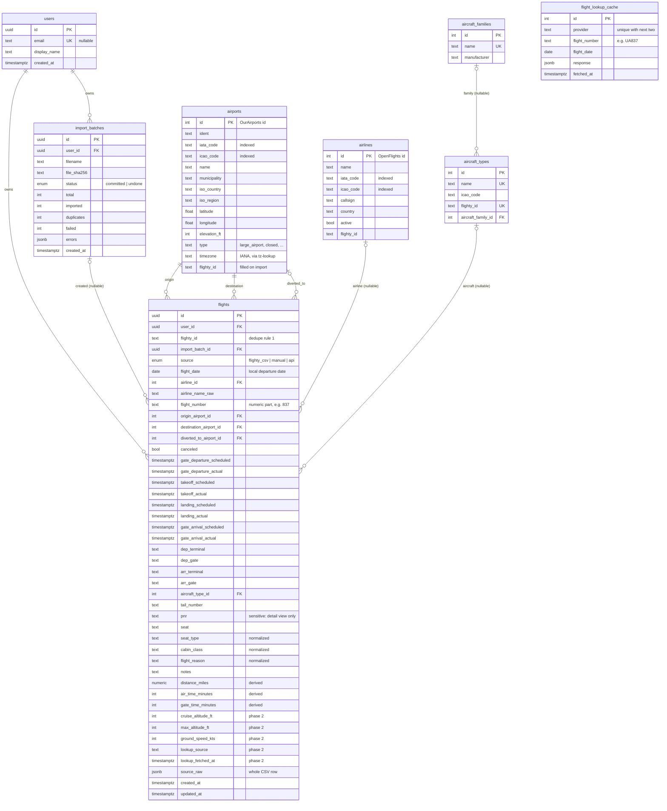

# Data model

Source of truth: [`apps/api/prisma/schema.prisma`](../apps/api/prisma/schema.prisma) plus the hand-written
SQL at the end of the init migration. Tables use snake_case; Prisma models use camelCase fields.

## Ownership and scoping

`flights` and `import_batches` carry `user_id`. All access goes through `apps/api/src/dal/*`, and
every function there takes `userId` first and filters by it. Raw-SQL aggregates (stats, map) build
their `WHERE` from `filtersSql(userId, …)`. `req.userId` is set by a single middleware
(`apps/api/src/http/resolveUser.ts`), which returns the seeded default user in Phase 1.

Reference tables (`airports`, `airlines`, `aircraft_types`, `aircraft_families`, `flight_lookup_cache`) are global.

## Dedupe

| Rule | When                 | Enforced by                                                                                                                                                                                                                                                        |
| ---- | -------------------- | ------------------------------------------------------------------------------------------------------------------------------------------------------------------------------------------------------------------------------------------------------------------ |
| 1    | `flighty_id` present | `UNIQUE (user_id, flighty_id)`. Postgres treats NULLs as distinct, so this behaves like a partial index on non-null IDs.                                                                                                                                           |
| 2    | `flighty_id` is NULL | Partial expression index `flights_dedupe_natural_key` on `(user_id, flight_date, COALESCE(airline_id::text, 'raw:' ‖ lower(btrim(airline_name_raw)), ''), COALESCE(upper(flight_number), ''), origin_airport_id, destination_airport_id) WHERE flighty_id IS NULL` |

The application mirrors rule 2 in `naturalKey()` (`apps/api/src/import/parseRow.ts`) so the import
preview can report duplicates before anything is written. Commit uses `INSERT … ON CONFLICT DO
NOTHING` (Prisma `createMany({ skipDuplicates: true })`), so duplicates that appear between preview
and commit are skipped rather than failing the batch. A manual create that hits rule 2 returns
`409 conflict`.

> ⚠️ Prisma can't express partial or expression indexes. When you generate a new migration with
> `prisma migrate dev`, **review the SQL**: Prisma will propose dropping `flights_dedupe_natural_key`
> and the `lower(...)` search indexes. Delete those `DROP INDEX` lines.

## Derived values

- `distance_miles`: haversine, statute miles, mean Earth radius 3,958.7613 mi, rounded to 0.1 mi,
  from origin to the **diversion airport if present**, otherwise the destination
  (`packages/shared/src/distance.ts`). Recomputed on every create/update.
- `air_time_minutes`: `takeoff_actual → landing_actual`, else `takeoff_scheduled → landing_scheduled`,
  else NULL. Negative or > 30 h results are treated as NULL.
- `gate_time_minutes`: `gate_departure_actual → gate_arrival_actual`, else the scheduled gate pair,
  else NULL (same bounds; `computeGateTimeMinutes`). The migration backfilled existing rows.
- `aircraft_types.aircraft_family_id`: **computed**, since no data source provides it.
  `classifyAircraftFamily()` (`packages/shared/src/aircraft.ts`) applies ordered rules to the type
  name and yields a marketing family such as "Boeing 777" (all 777 variants), "Boeing 737" (Classic,
  NG and MAX) or "Airbus A320" (A318–A321, ceo and neo). A type no rule matches keeps a NULL family
  and shows as "Unknown" in stats. Families are assigned when a type is first created (import or
  manual entry) and by `npm run seed:aircraft-families` (also run on every `docker compose up`),
  which creates the family rows and fills in any type without one. It never overwrites an existing
  assignment, so a manual correction sticks; after changing a rule, null the affected rows and re-run it.
- Times are stored as UTC `timestamptz`. Naive local inputs (CSV cells or form fields without an
  offset) are interpreted in the relevant airport's IANA zone:

  | Field                                        | Zone                                           |
  | -------------------------------------------- | ---------------------------------------------- |
  | gate departure, takeoff (scheduled + actual) | origin                                         |
  | landing, gate arrival (scheduled)            | destination                                    |
  | landing, gate arrival (actual)               | diversion airport if present, else destination |

## Normalization

- `cabin_class`, `seat_type`, `flight_reason`: trimmed, `_`/`-` → space, title-cased
  (`PREMIUM_ECONOMY` → `Premium Economy`), so they group cleanly in stats.
- `flight_number`: the numeric designator without carrier or leading zeros (`AA 0100` → `100`). The
  carrier prefix is used only to resolve the airline.
- `tail_number`: upper-cased, spaces removed. `seat`: upper-cased.
